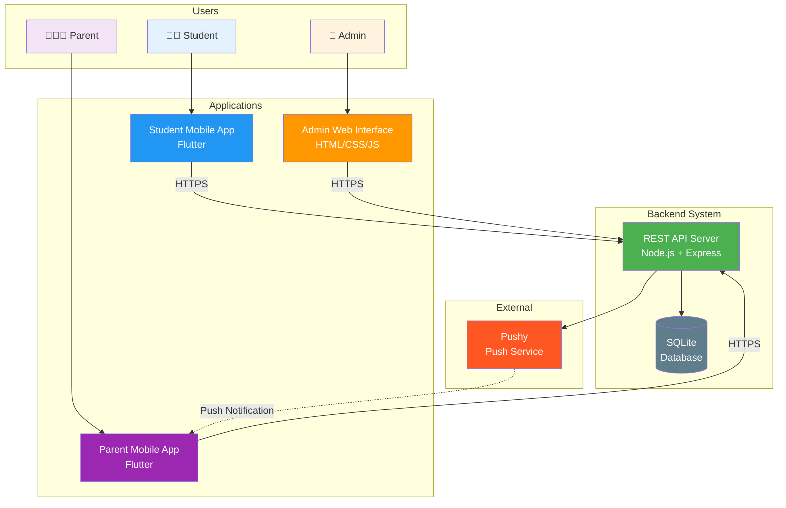
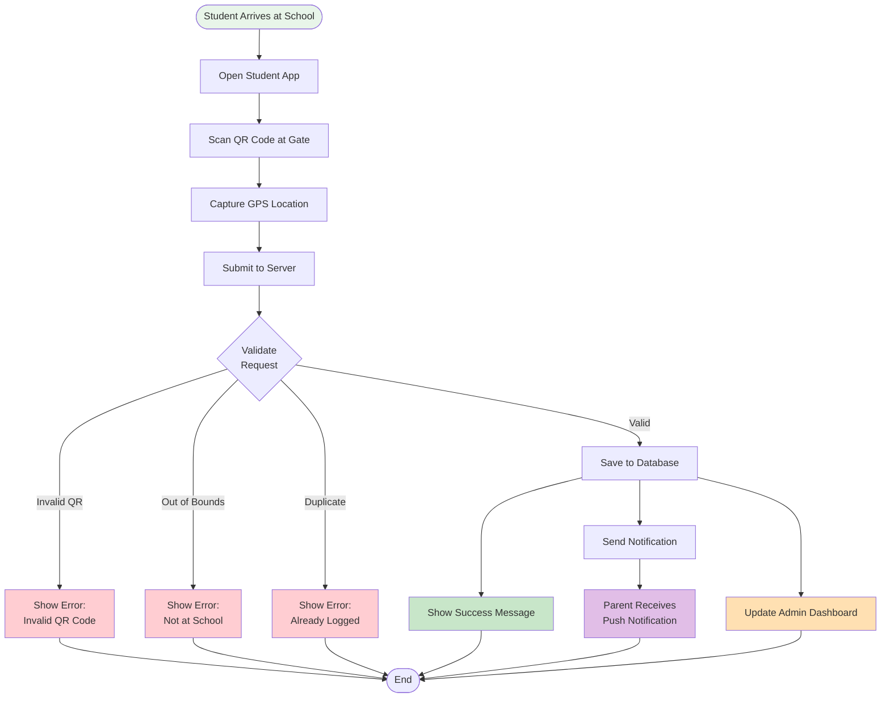
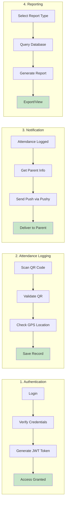
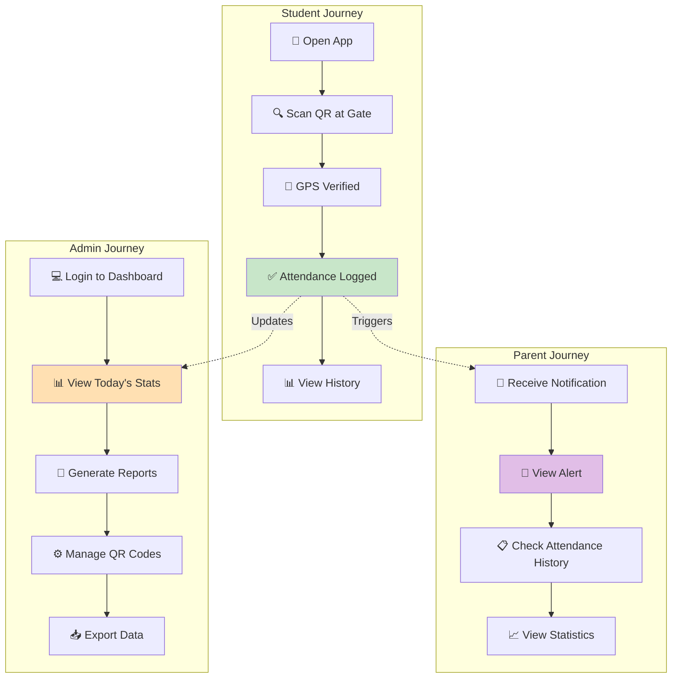
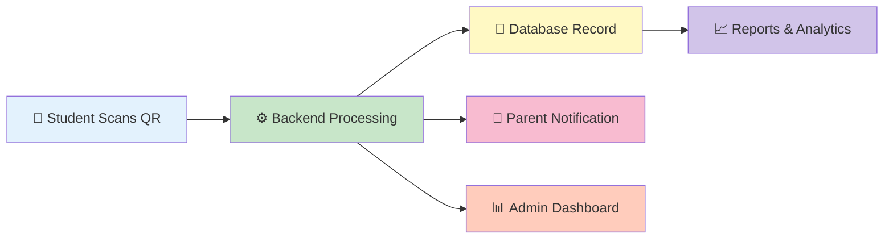
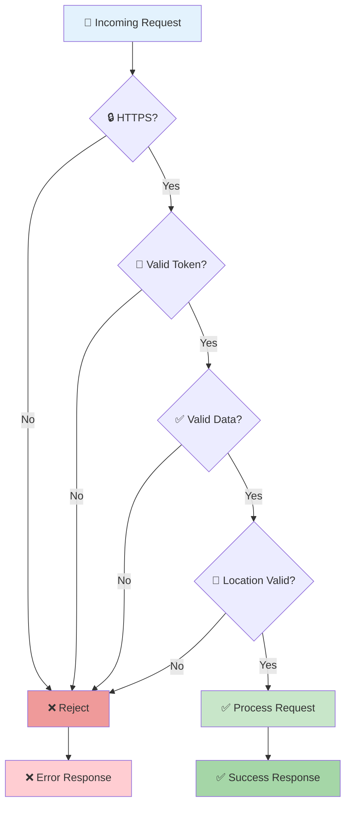
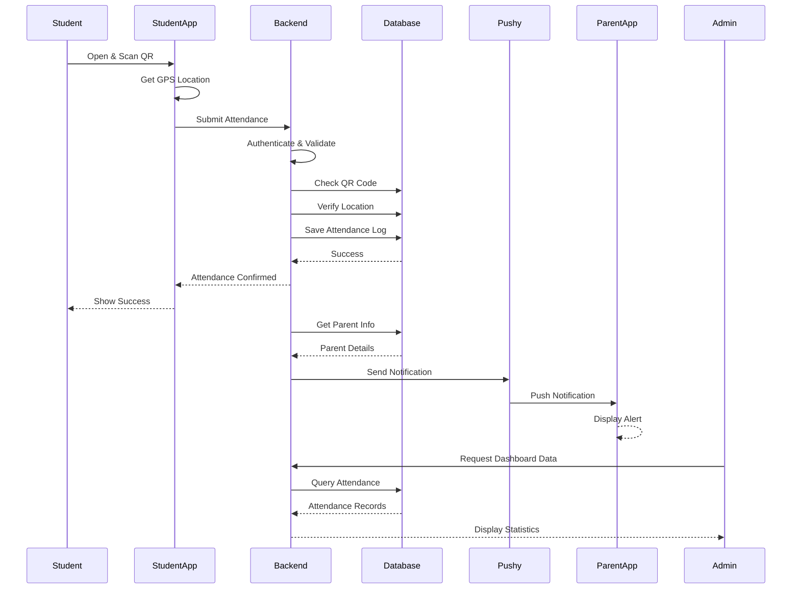
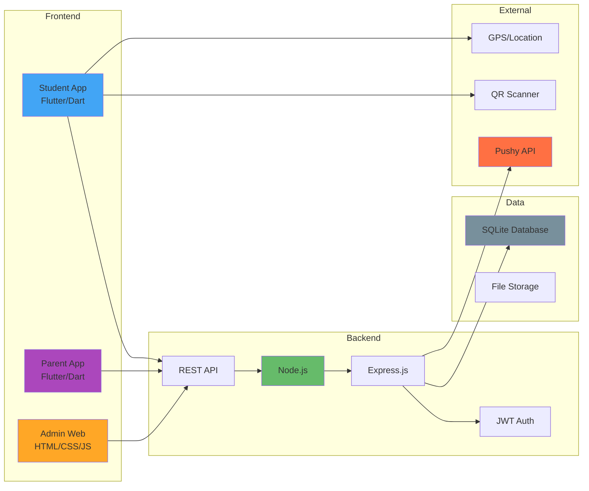
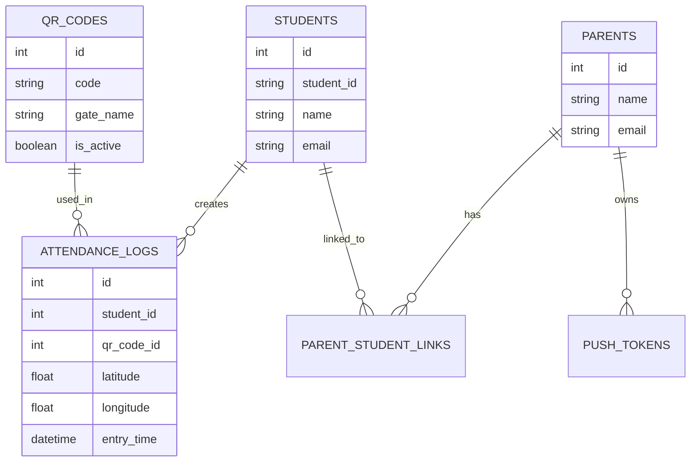
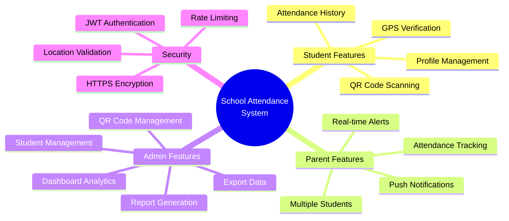

# School Attendance System - High-Level Flowchart

## System Overview

## Main Attendance Flow

## Core System Processes

## User Journeys

## Data Flow

## Security & Validation Layers

## Complete End-to-End Flow

## Technology Stack

## Database Schema Overview

## Key Features Summary

